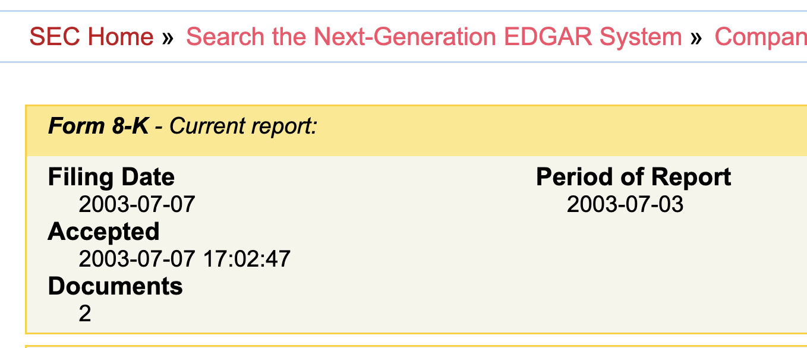
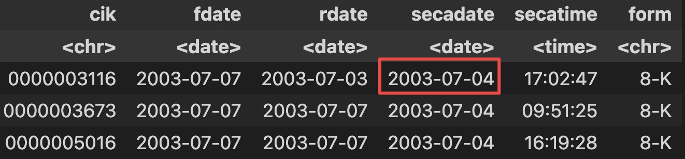

# The "Accepted Date" from WRDS SEC suite doesn't match EDGAR

# The issue

I found the filing and accepted date in WRDS SEC Analytics doesn't agree with EDGAR.

For example, the following 8-K event (cik="0000003116") has an accepted date of **2003-7-7** ([EDGAR link](https://www.sec.gov/Archives/edgar/data/3116/000095013703003712/0000950137-03-003712-index.htm)):

But in WRDS SEC Analytics Suite, the accepted date (`secadate`) is **2003-7-4** while the accepted time (`secatime`) and report time (`rdate`) are correctly parsed:

# WRDS's response

WRDS confirms my findings:

You are correct in your findings. For older filings, the tag `<ACCEPTANCE-DATETIME>` doesn't always exist in the raw text. Therefore, we use the date on the `<SEC-HEADER>` row for older filings. 


When I asked "how old is old," WRDS further adds:

EDGAR and the raw filing are one in the same. Thus, it's not an issue of whether they match or not. Rather, accepted datetime is not a reliable field for old filings. I refer to old filings as 2003 or earlier. Thus, you'll start to see some filings with accepted datetime populated in 2003 as the SEC started to move to an electronic system. However, most filings in 2003 and earlier will not have this information, and even those that do may not be reliable. A more accurate value for the accepted time comes from the `<SEC-HEADER>` row for these filings.


My understanding is:

- **We should not trust "accepted date/time" in and before 2003.**

- **When we see a discrepency between WRDS and EDGAR for these old filings, WRDS *might* be more trustable.**
