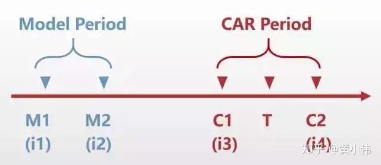
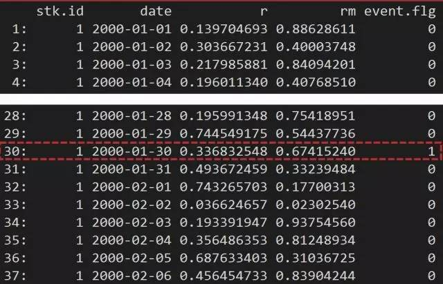

# 35行代码搞定事件研究法（上）


这期大猫课堂将会教大家如何用35行R代码写出最有效率的事件研究法。

注意，本代码主要使用data.table完成，关于data.table包的相应知识会在涉及的时候进行讲解。在以后的课堂中，我们会重点介绍data.table这个包。

# 事件研究法的基本过程

首先，我们先来回顾一下事件研究法的基本过程：




根据上图，T日是事件日，事件研究法的目的是计算事件日前后若干日超额收益（CAR）之和，而超额收益的定义为该股当日收益减去模型收益之差。如果我们用C1与C2标记CAR窗口期，用M1与M2标记模型的估计期（C1、C2、M1、M2都为正数，定义见上图），则上图的含义为：

在 [T - M1, T - M2] 的区间内估计市场模型，并在 [T - C1, T + C2] 的区间内计算超额收益率。

在这里，我们姑且用最简单的市场模型来估计收益，即：

r = alpha + beta * (r - rm)

其中，r 表示个股每日的收益率，rm 表示对应日期市场指数的收益率。

# 样例数据集

一切没有栗子的讲解都是耍流氓，现在我们就假设需要对如下数据集运用事件研究法：




其中，stk.id表示股票代码，date是日期，r表示个股收益率，rm表示市场收益率，event.flg是事件日标识。如果当天不是事件日，event.flg为0，否则为1。（似乎莫名其妙立了flag……）由上图可知，只有在第30行发生了事件（用红框框出）。

不妨进一步假设C1 = C2 = 1, M1 = 10, M2 = 5。也即我们的CAR窗口期为 [T - 1, T + 1]，模型的估计期为[T - 10, T - 5]。当然那么短的模型估计期（5天）是非常不现实的，这里仅为了举例方便这样设定。

# 举一个详细的栗子

OK，既然栗子也有了，我们就要正式开工啦。本着从特殊到一般的原则，在这一讲中，我们首先假设现在只有一个事件日。针对这一个事件日，大猫会给出一个叫做 do_car() 的自定义函数计算其对应的超额收益。当以后出现多个事件日时，我们只要对每个事件日都调用一次 do_car() 函数就可以了。

这种“先把任务分解为任务单元，为每个任务单元写一个函数，然后再批量调用函数”的方法，希望大家好好掌握哦！

既然我们的目标是写一个函数 do_car()，那么其肯定有参数。为了计算超额收益，我们需要以下四个输入变量：1）个股收益向量 r， 2）市场收益向量 rm，3）日期向量，4）事件日发生的序号 n。因此这个 do_car() 大致会长这个样子：

```R
do_car <- function(n, r, rm, date) {...}
```

那么如何把函数的主体填充进去，从而计算单个事件日对应的超额收益呢？大猫给出以下三个步骤：

Step I. 先定位事件日，然后根据给定的参数分别截取出模型估计期 [T - 10, T - 5] 以及CAR窗口期 [T - 1, T + 1] 的收益率 r、rm

Step II. 根据模型估计期的 r 与 rm 数据估计收益率模型的参数 alpha，beta，并计算超额收益率

Step III. 输出最终结果

## Step I：截取收益率向量

我们用n来标记事件日的序号。例如在我们的例子中，第30天发生了事件，因而n=30。需要注意的是在我们的例子中 n 是一个标量，下节课中我们会把n拓展为向量，也即引入多个事件日。

确定了事件日序号之后，我们就可以用他来截取收益率向量了。模型估计期的个股收益向量为 r[n - m2, n - m1]，（n - m2表示截取起点，n - m1表示截取的终点），我们将其命名为 r.model。同理，模型估计期对应的市场收益率的向量为 rm[n - m2, n - m1]，我们将其命名为 rm.model。类似的，我们可以分别截取出CAR窗口期的收益率向量。代码如下：

```R
i1 <- n - m1

i2 <- n - m2

i3 <- n - c1

i4 <- n + c2

r.model <- r[i1:i2]

rm.model <- rm[i1:i2]

r.car <- r[i3:i4]

rm.car <- rm[i3:i4]
```

其中，r 表示个股收益，rm 表示市场收益，后缀model表示模型估计期，后缀car表示CAR窗口期。

## Step II：估计模型，计算超额收益率

得到了r.model, rm.model 这两个变量，我们就可以进行收益模型的估计了。我们使用R内置的多元线性回归函数：
```R
model <- lm(r.model ~ I(r.model - rm.model))> coef <- coef(model)

ars <- r.car - predict(model, list(r.model = r.car, rm.model = rm.car))
```
先来看第一行。其中，lm是回归函数，“~”符号左边的是因变量r.model，右边的是自变量 I(r.model - rm.model)，最后得到的回归模型命名为“model”。R默认回归中有常数项，因而在公式中不需要显式表示。另外，函数I()表示要把r.model - rm.model的结果作为一个变量来看待。

再来看第二行。要知道在R中，线性回归的结果是一个类名为“lm”的对象，这个对象包含了回归结果的系数、p值、残差等等元素。而coef()函数的作用就是提取回归结果的系数。

最后看第三行。这一行的作用是用估计得到的模型预测CAR窗口期股票的收益率。predict()函数用来预测模型。第一个参数model指出了预测所依据的模型（就是我们上面估计得到的model），第二个参数指定了自变量，其中“r.model = r.car”表示把model中的r.model变量用r.car变量代替，类似的，"rm.model = rm.car"表示把model中的rm.model变量替换成rm.car。最后，我们用股票的实际收益率（r.car）减去由模型计算得到的收益率（predict()函数计算的结果），就能得到股票的超额收益（ars, abnormal returns）。需要注意的是，刚才提到的ars, r.car, r.model等变量都是向量，而不是标量。

## Step III：输出最终结果

得到了超额收益率向量ars，我们需要确定最终输出的结果应该是什么样子。一般来说，对于每一个事件日（非事件日我们不输出结果），我们需要保留股票代码stk.id、事件日date、该事件日对应的收益率模型系数coef，以及该事件日窗口期间的超额收益。因此最终输出结果应该大致长下面这个样子：


关于上面这个输出结果，有以下三点需要注意：

1. 图中每一行都对应一个事件日，非事件日不输出结果。上图中说明6月17日发生了一个事件。

2. ars是超额收益率向量，因为我们的例子中把超额收益率区间定为 T 日前后各一天，因此 ars 共有三个元素。注意，我们这里没有直接输出加总后的CAR，而是输出超额收益向量ars。这是因为输出超额收益向量便于我们后期进行各种复杂的计算。

3. coef、ars都是向量

这一步对应的代码是：

```R
list(date = date[n], coef = list(coef), ars = list(ars))
```

这一行代码指定了我们需要输出的三个变量：事件日、收益率模型系数以及超额收益。其中，coef = list(coef)的含义是把向量coef打包成一个list类型的变量，并命名为coef。date = date[n]的含义是选取date变量的第n个元素（也就是事件日），并命名为date。最外面的list()则把其中的三个元素打包成一个大的list。值得一提的是，我们在这里运用了把向量打包成list的这个小技巧，这一技巧在进行回归计算时非常有用，其作用以及应用场景将会在以后详细讲述。现在只要知道它用来输出结果就可以了。

将step I ~ III 归纳为函数

把 step I 至 step III 归纳成函数的话就是：已知个股收益率向量r、市场收益率向量rm、日期向量date，以及事件日的序号n（标量），我们就可以用以下函数计算对应事件日的超额收益率向量ars——

```R
do_car <- function(n, r, rm, date) { 
    stopifnot(m1 > m2) 
    if (n - m1 < 0) { 
        cat("n =", n, "is too small \n") 
    } else if (n + c2 > length(r)) { 
        cat("n =", n, "is too large \n") 
    } else { 
        i1 <- max(1, n - m1) 
        i2 <- n - m2 
        i3 <- n - c1 
        i4 <- n + c2 
        r.model <- r[i1:i2] 
        rm.model <- rm[i1:i2] 
        r.car <- r[i3:i4] 
        rm.car <- rm[i3:i4] 
        model <- lm(r.model ~ I(r.model - rm.model)) 
        coef <- coef(model) 
        ars <- r.car - predict(model, list(r.model = r.car, rm.model = rm.car)) 
        list(date = date[n], coef = list(coef), ars = list(ars)) }}
```

其中，(n - m1 < 0)以及(n + c2 > length(r)) 这两条语句的作用是：如果事件日出现在收益率向量的太前面或者太后面，以至于向前向后追溯无法满足估计模型或者CAR窗口期的要求，那么该事件日将被剔除。

下期预告

至此，我们已经学会如何针对单一事件日计算超额收益了。然而现实生活中我们往往要计算多个股票多个事件日的超额收益，这时应该怎么做？小伙伴们不用担心，其实只需要添加几行代码就可以了。具体做法，就请期待下一次的大猫课堂——35行代码搞定事件研究法（下）
